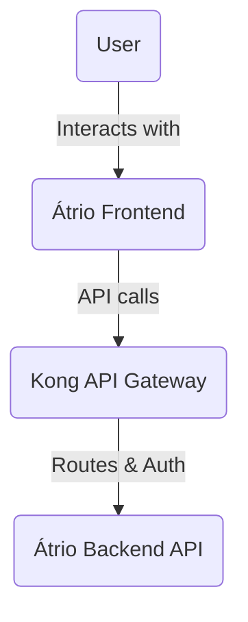
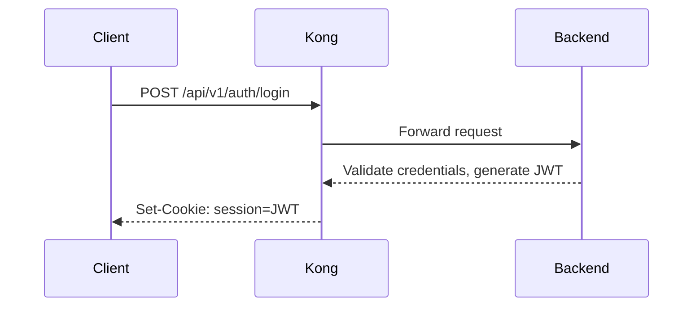
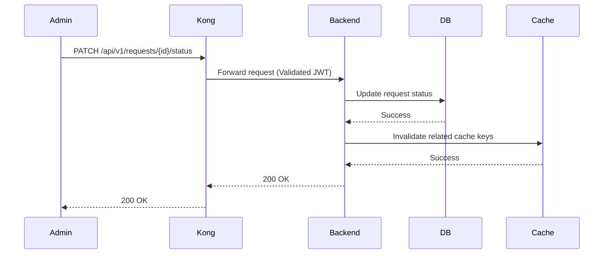
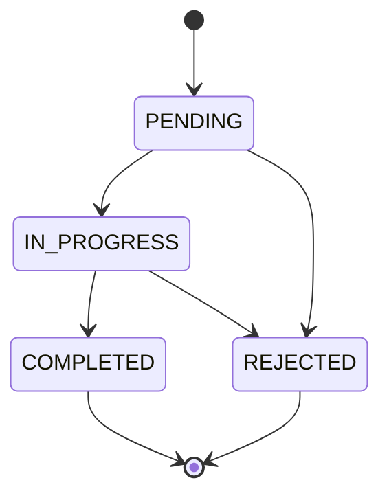
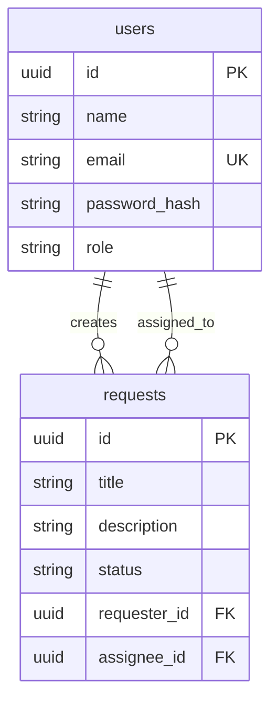

# Architecture

## Diagrams

### C4 Context

### Sequence Diagram: Login via Kong

### Sequence Diagram: Status Change & Cache Invalidation

### State Diagram: Request Lifecycle

### ER Diagram

